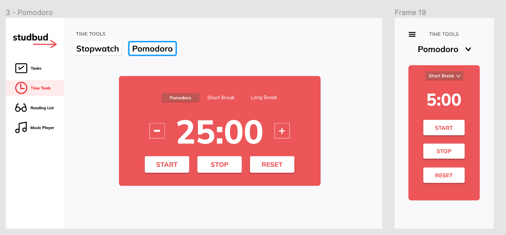
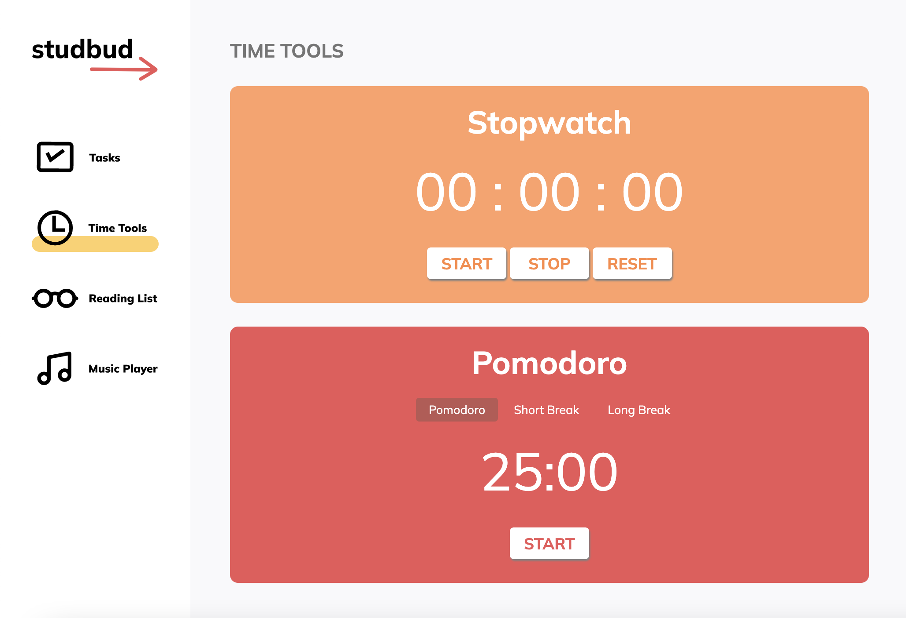

# **StudBud - DECO2017 A3**
### **Created by Rachel Lee**

## Iteration 1
I started by creating the timer tools, specifically the stopwatch and Pomodoro timer. After an initial javascript draft of the stopwatch I was able to test on three users studying similar degrees as my personas. I allowed them to interact with the feature and give feedback based on their interactions. All three participant gave similar feedback outlining the need for milliseconds to be shown on the screen as they said most students would use a stopwatch to time tests and mimic test conditions. I was able to iterate and include the additional measurement.

## Iternation 2 
When creating my Pomodoro timer, I was able to ask for feedback on the   user interface. I showed different participants the mockups and asked for feedback. The two main pieces of feedback I received were to consider spreading out buttons for the mobile version and to create hover states so they know which buttons are pressable. I was able to iterate my app by first adding css for hover states as well as removing the tabs and placing both features on the same page so it is easily able to be scrolled for the users on mobile.

 

 

## Iteration 3 
Similarly with the navigation bar, a piece of feedback given was that the red from the mockup reminded students of ‘error’ and a different colour could be considered to show which tab was active and chosen. From this I chosen to use css and create an underline for the tab that the user was visiting. 

### Self-Reflection
If given the chance to improve on the assessment, I would definetely allocation more time playing around different ways of storing objects and data. I was unable to get my kanban board to fully function and would definetly continue to play around with the code and try and debug and find the cause. Additionally, I would try and include more design methods into my user testing. This time round I asked my particpants what they thought of a specific feature, however next time I would create tasks and ask them to think-aloud and complete them without my assistence to not only test the functionality but the user experience and get feedback based on that along with UI feedback.

## References
- *A. (2022, April 08). How to build a Pomodoro Timer app with JavaScript. Retrieved May 20, 2022, from https://freshman.tech/pomodoro-timer/*
- *A. (2022, April 08). How to build a Pomodoro Timer app with JavaScript. Retrieved May 20, 2022, from https://freshman.tech/pomodoro-timer/%*
- *Oliveira, M. (n.d.). Book list - codepen. Retrieved June 1, 2022, from https://codepen.io/mateusmlo/pen/JZKbar*
- *Create Custom Music Player in JavaScript. (2021, June 08). Retrieved June 1, 2022, from https://www.codingnepalweb.com/create-music-player-in-javascript/*
- *K. (2022, April 25). Creating a Kanban Board with HTML, CSS & JavaScript. Retrieved June 1, 2022, from https://karthikdevarticles.com/creating-a-kanban-board-with-html-css-and-javascript*

#### Icons
- [Font Awesome](https://fontawesome.com/)

**Thank You :)**